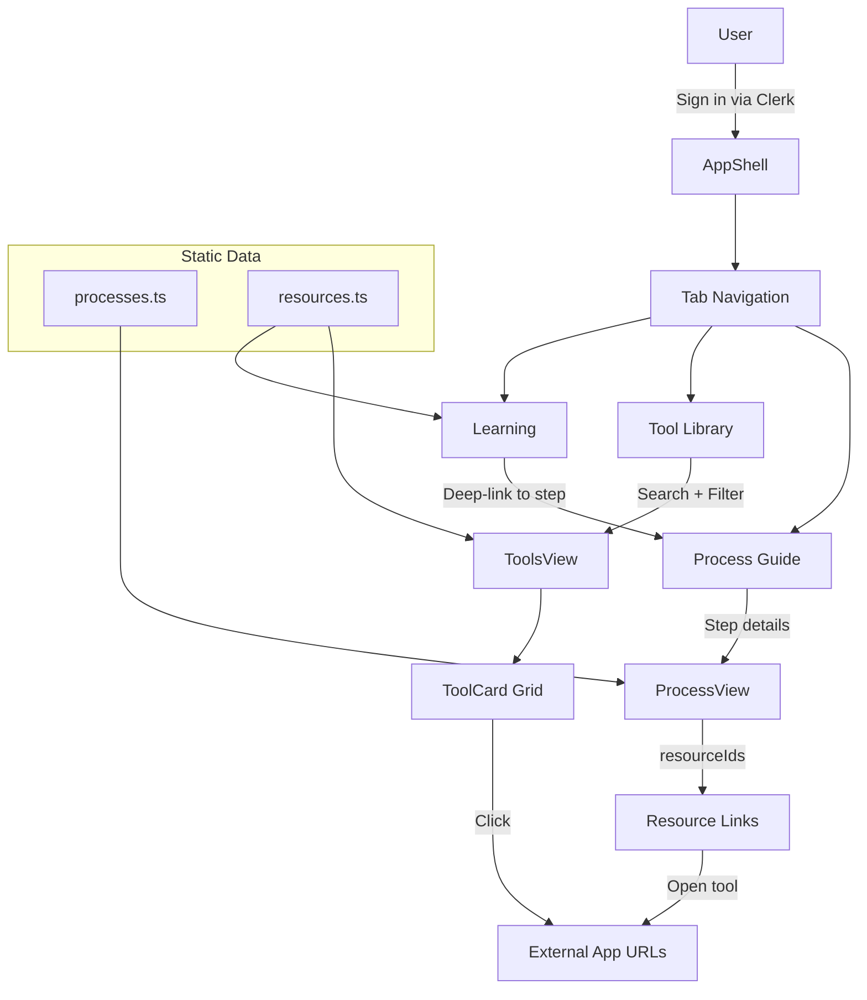

# Marketing Library

Customer portal for AI marketing processes, tools, and learning resources.


## Features

- **Process Guide** — Step-by-step marketing process flows with linked tools and resources
- **Tool Library** — Searchable, filterable grid of marketing tools with status indicators (live/beta/coming-soon)
- **Learning** — Courses, workshops, and AI learning resources with deep-linking to process steps
- Three-tab navigation (Process Guide, Tool Library, Learning)
- Static content defined in TypeScript data files (no database)
- Responsive design with design system components

## Tech Stack

| Layer | Technology |
|-------|-----------|
| Frontend | React 19, Vite 8, TypeScript |
| Auth | Clerk |
| Design System | @boriskulakhmetov-aidigital/design-system |

## Getting Started

```bash
git clone https://github.com/boriskulakhmetov-aidigital/AIDigital-Labs-AI-Marketing-Library.git
cd AIDigital-Labs-AI-Marketing-Library
npm install

# Create .env.local with Clerk publishable key
npm run dev
```

## Architecture



## Folder Structure

```
src/
  main.tsx              ← Entry point, ClerkProvider, theme
  App.tsx               ← AppShell + three-tab view
  App.css               ← Portal styles
  types.ts              ← Resource, Process, ProcessStep types
  data/
    processes.ts        ← Process definitions
    resources.ts        ← Tool/course/workshop definitions
  components/
    ProcessView.tsx     ← Process guide with flow visualization
    ToolsView.tsx       ← Tool library grid
    ToolCard.tsx        ← Individual tool card
    LearningView.tsx    ← Learning resources
```

## Key Components

| Component | Purpose |
|-----------|---------|
| `AppShell` | Auth gate, layout (from design system) |
| `ProcessView` | Step-by-step process flow with detail panels |
| `ToolsView` | Searchable tool library grid |
| `ToolCard` | Tool card with status badge and action button |
| `LearningView` | Learning resources with process deep-linking |

## Content Management

All content is defined in static TypeScript files:

- `src/data/processes.ts` — Marketing process definitions with steps
- `src/data/resources.ts` — All tools, courses, workshops with URLs and status

To add a new tool or process step, edit these files directly and redeploy.

## Deployment

Manual deploy (to avoid accidental content pushes):

```bash
npm run build
npx netlify-cli deploy --prod --dir=dist --site=c7f2fc20-03a6-4053-871a-c35cb9099cd9
```
